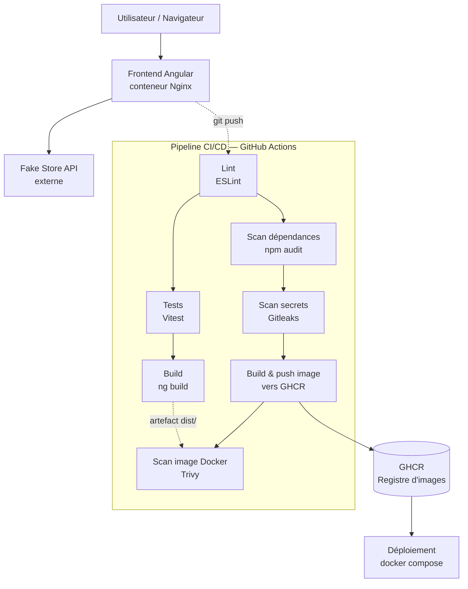

# Architecture et chaîne de valeur — ShopSN

## Schéma logique

## Description de la chaîne de valeur

1. **Développement** : le code est écrit localement, testé (`ng test`), linté (`ng lint`) avant chaque commit.
2. **Push vers GitHub** : déclenche automatiquement le pipeline CI/CD sur la branche `main` ou une pull request.
3. **Qualité et tests** (jobs `lint`, `test`, `build`) : vérifient que le code respecte les standards Angular et que tous les tests unitaires passent, avant toute étape de sécurité ou de déploiement.
4. **Sécurité — shift-left** (jobs `security-deps`, `security-secrets`) : s'exécutent en parallèle des tests, indépendamment du build Docker, pour détecter les problèmes le plus tôt possible dans le cycle.
5. **Packaging** (job `docker-build-push`) : ne se déclenche que si toutes les étapes précédentes ont réussi, et uniquement sur la branche `main` — l'image est construite en multi-stage (Node pour build, Nginx pour servir) et publiée sur GitHub Container Registry.
6. **Sécurité — image** (job `security-image`) : scanne l'image fraîchement publiée pour des vulnérabilités au niveau système (Alpine, Nginx), complémentaire au scan des dépendances applicatives.
7. **Déploiement** : `docker compose up` récupère l'image et lance le conteneur, healthcheck actif pour la supervision de disponibilité.

## Composants du schéma (correspondance avec le sujet d'examen)

| Élément demandé | Implémentation |
|---|---|
| Utilisateur / navigateur | Client HTTP accédant à l'app sur le port 8080 (local) ou 80 (conteneur) |
| Frontend conteneurisé | Image Docker multi-stage, Angular buildé et servi par Nginx |
| API Fake Store | Consommée directement en HTTPS depuis le frontend (`environment.apiUrl`) |
| Pipeline CI/CD | GitHub Actions, 7 jobs, `.github/workflows/ci-cd.yml` |
| Registre d'images | GitHub Container Registry (ghcr.io) |
| Outils de sécurité | ESLint, npm audit, Gitleaks, Trivy — détaillés dans `docs/securite.md` |
| Système d'observabilité | Logs Nginx + healthcheck Docker, stratégie détaillée dans `docs/observabilite.md` |